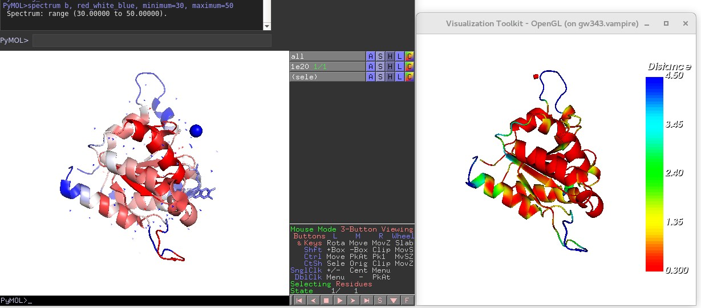

# Visualizing Protein Flexibility using The Visualization Toolkit (VTK)
Project of CS 8395 Open Source Programming for Medical Image Processing. A program based on VTK library to show the distance of two conformations of a protein. The further the distance, presumably the more flexible. The result is compared with flexibility data contained in original PDB file. Source codes are in PDBConverter.cxx

**Result**

# Detailed report:

**Abstract**

  Comparison of two conformations of proteins can give us some useful information about a protein ensemble. For example, it allows us to check the distance between two conformations and hence infer the flexibility of a certain part of a protein. This comparison can be realized in PyMol, a commonly used commercial protein visualization software. However, the comparison is done by superimposing two conformations, which may make some important parts of protein covered by the other and hard to notice some details. This paper presents a new way for visualization of distance between two by coloring only one protein conformation according to their distance using The Visualization Toolkit (VTK). By comparing our distance-based color protein model with protein flexibility da-ta, we can find that our result resembles protein flexibility. 
  
**Keywords**: Protein, Flexibility, VTK.

# 1	Introduction

## 1.1	Background

Comparison of two conformations of proteins can give us some useful information about a protein ensemble. For example, it allows us to check the distance between two conformations and hence infer the flexibility of a certain part of protein. This comparison be realized in PyMol, a commonly used commercial protein visualization software. However, the comparison is done by superimposing two conformations, which may make some important parts of protein covered by the other and hard to compare. 

VTK is an open-source, freely available software system for 3D computer graphics, image processing and visualization developed by Kitware. VTK consists of a C++ class library and several interpreted interface layers including Tcl/Tk, Java, and Python
This paper presents a new way for visualization of distance between two by color-ing only one protein conformation according to their distance using VTK.

# 1.2	Challenges

**Data Format**

The first challenge I encountered was the data format. Protein Data Bank (PDB) is a widely used tool in the protein research community. It contains both the protein struc-tures determined from experimental methods like X-ray, Nuclear magnetic resonance spectroscopy (NMR) and predicted models from computational methods. However, it contains only the coordinates of atoms. Namely, it does not have a mesh infor-mation that other common VTK acceptable file format has, such as .nrrd, .nii.  

The solution was to use PyMol to visualize protein and export as VRML file (.wrl) and import into VTK using vtkVRMLimporter.

**Numerous Actors**

The second challenge rose after I imported .pdb file. It contains hundreads of vtkActor in the vtkActorCollection. This makes the visualization slow and not very responsive. 

The solution was to use vtkAppendPolyData and combine these vtkPolyData

# 2	Method

## 2.1	Materials and Coding Environment
I used two homogeneous .pdb files for this method. One is [1p3y.pdb](https://www.rcsb.org/structure/1P3Y) and the other is [1e20.pdb](https://www.rcsb.org/structure/1E20)

The codes was written in C++ and tested in Vanderbilt ACCRE environment with VTK loaded.

## 2.2	Data Preparation and Import

Since .pdb file only provides coordinates information of atoms, there are more than one possibilities to represent a protein (See Fig. 1). But we need a mesh file (see Fig. 2) so we can manipulate it using VTK.

**Fig. 1.** Different visual representations of .pdb file. (from left to right: sphere representation, cartoon representation, surface representation)

**Fig. 2.** A mesh structure of surface representation.

**Early Attempts**

Initially, I wanted to write my on reader of .pdb file. By studying another open-source protein software developed by UCSF, Chimera [1], I soon found it is infeasible since the codes for visualizing .pdb file are around 3000 lines and thus beyond the scope of this one-month project.

  So I tried to import existing codes from Chimera and make it work in VTK. Since Chimera codes were written in Python. I was trying to use a boost/python library to import the codes. However, this attempt failed due to the fact that I couldn’t get it to work in ACCRE.

**Final Solution**

The data was first imported in Pymol using fetch command and exported as VRML by going to “File-Export Image As-VRML 2…”
Then data was imported into C++ using the vtkVRMLimporter. Codes are given as below:

    vtkSmartPointer<vtkVRMLImporter> importer1 =   vtkSmartPointer<vtkVRMLImporter>::New();
  
    importer1->SetFileName ( input1.c_str() );

    importer1->Update();

## 2.3	General Work Pipeline

**Fig. 3.** A diagram of the workflow. The top and bottom workflows show the first part. The left-most double-arrow shows the second part while the middle workflow shows the third part.

The work flow can be divided into three main parts (See Fig. 4).

  The first part is to get the vtkPolyData. In order to do so, we need to get the map-per. To get the vtkMapper, we need to get vtkActor. To get vtkActor, we need to get vtkActorCollection. To get vtkActorCollection, we nned to get vtkRenderer. And vtkRenderer is what we can get from vtkVRMLimporter. Corresponding methods for getting those classes are illustrated in the diagram above. Note that in order to get Actor using NextActor(), it is needed to call InitTraversal() beforehand.
  
  The second part is to calculate the distance between two vtkPolyData. Since there are hundreds of vtkPolyData (~900 for 1e20.pdb and ~700 1p3y.pdb) so a combina-tion step is needed before the calculation to make the visualization faster. A detailed discusstion about this numerous PolyData is shown in the following section. 
  
  The third part is to visualize the distance. It is a reverse process of getting vtkPoly-Data.
  
  ## 2.4	Combinations of vtkPolyData
  
Since there are hundreds of actors present in the scene, firstly we need to know what these actors are. A simple experiment was conducted to show these actors.

**Fig. 4.** Display of different numbers of actors. 

By displaying different numbers of actors, we can see that actors are the building blocks of the final visualization with no defined biological meaning. 101th actor is important since after that, not much change can be seen in the visualization.

The combination of corresponding vtkPolyData can be realized by the following codes and we need to do this for both of the input files.

    vtkSmartPointer<vtkAppendPolyData> appendFilter2 = vtkSmartPointer<vtkAppendPolyData>::New();

      for (int i = 0; i < (actors2->GetNumberOfItems()); i++){

   	    vtkSmartPointer < vtkActor > actor2 = actors2->GetNextActor() ;
      
	      vtkSmartPointer < vtkMapper > mapper2 = ac-tor2->GetMapper() ;
      
	      vtkSmartPointer < vtkPolyData > dataset2 = dy-namic_cast < vtkPolyData * > ( mapper2->GetInput() ) ;
      
        appendFilter2->AddInputData(dataset2);
      
    }

    appendFilter2->Update();

    //clean duplicate data for protein 2

    vtkSmartPointer<vtkCleanPolyData> cleanFilter2 =vtkSmartPointer<vtkCleanPolyData>::New();

    cleanFilter2->SetInputConnection(appendFilter2->GetOutputPort());

    cleanFilter2->Update();

    vtkSmartPointer<vtkPolyDataMapper> mapper2 = vtkSmartPointer<vtkPolyDataMapper>::New();

    mapper2->SetInputConnection(cleanFilter2->GetOutputPort());
    
# 3	Result

By comparison our result with protein b-factor, which is an indicator of protein flexi-bily. We can find that my result is similar to b-factor result in general. Both are rigid in the core of protein and flexible outside. If we take a closer look, there are some ex-ceptions, which is expected. Since b-factor is the statistical result of many different conformations but my result is just distance between two conformations, there will be some discrepancy. 

**Fig. 5.** Comparison of b-factor in Pymol and my result. Blue in both graph denotes flexible parts while red in both graph denotes rigid parts.

# 4	Further Discussion

There are two bugs noticed in this project and may be addressed in the future en-deavor. (See Fig. 6 and Fig. 7)

**Fig. 6.** Before combination, the rings in original visualization (left) become cylinders in VTK(right)

**Fig. 7.** After combination, the ball and cylinders are even gone.

# 5	Acknowledgement

I want to thank Prof. Ipek Oguz for her patience in teaching me the basics about VTK, answering my questions, debugging and giving suggestions on how to combine PolyData and other coding options.

I also appreciate the help from my lab colleagues, Ben Brown and Jeff Mendenjl, who helped me understand the biological meaning of distance between two confor-mations and aided me in comparing b-factor visualization from PDB with my result.
References

1.	Chimera Documentations: https://www.cgl.ucsf.edu/chimera/docs/sourcecode.html. 
2.	VTK Documentations: https://www.vtk.org/doc/release/7.1/html/

